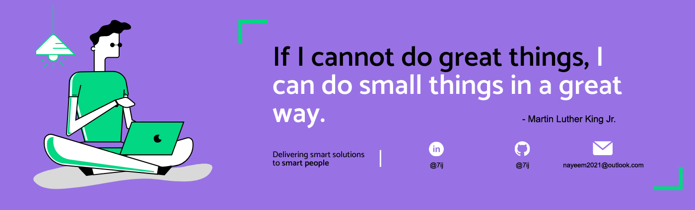

<h1 align="left">Hello I'm Md. Ashiqur Rahman Naeem</h1>

<!--
**7ij/7ij** is a ✨ _special_ ✨ repository because its `README.md` (this file) appears on your GitHub profile.
Here are some ideas to get you started: -->

  
  

  

## 👨🏻‍💻 About Me:

- 🙋‍♂️ All about me is at **[My Website](https://7ij.github.io/)**

- 🔭 I’m currently working on `Something Intresting`.

- 🌱 I’m currently learning `Android(Kotlin) Stack`

- 👯 I’m looking to collaborate for `Dev Projects`

- 🤔 I’m looking for help with `Competitive Programming`

- 💬 Ask me about anything, Except my strong points :sweat_smile:

- 👨‍💻 Life Hack: Learn new tech :fire: and share what you have learned :tada:

- ⚡ Fun fact: I waste most of my time thinking many things

## 🛠️ Technologies and Tools I use:

 
 
 

## ❤️ Let's get connected:

    

## 🤝 Support Me:

## 📊 My GitHub Data:

  
  

